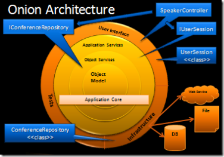
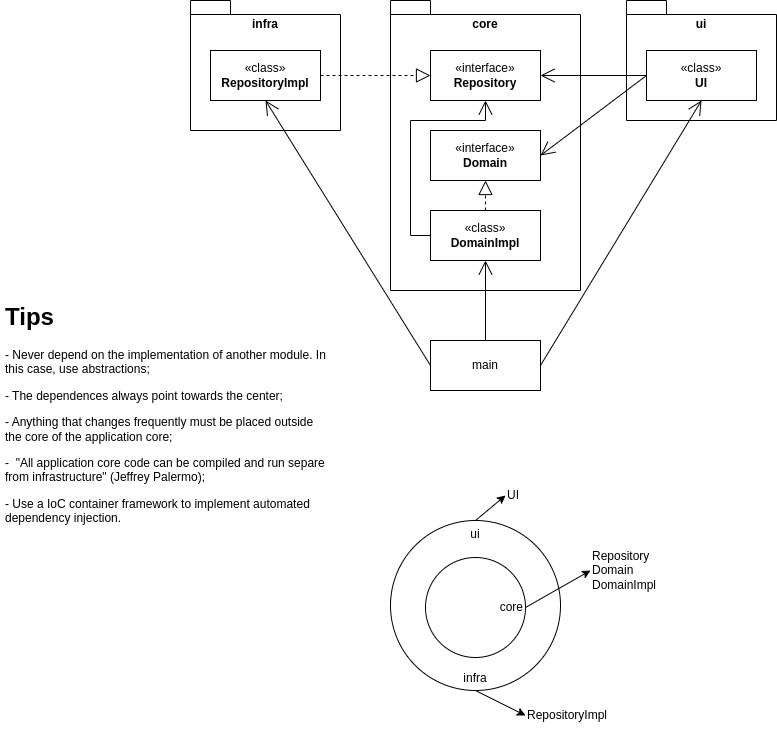

# Onion Architecture

[Jeffrey Palermo](https://jeffreypalermo.com/2008/07/the-onion-architecture-part-2/)

## Description
This is a example of Onion Architecture built based on Jeffrey Palermo's articles.

## Diagrams

## References
- [Jeffrey Palermo - The Onion Architecture Part 1](https://jeffreypalermo.com/2008/07/the-onion-architecture-part-1/)
- [Jeffrey Palermo - The Onion Architecture Part 2](https://jeffreypalermo.com/2008/07/the-onion-architecture-part-2/)
- [Jeffrey Palermo - The Onion Architecture Part 3](https://jeffreypalermo.com/2008/08/the-onion-architecture-part-3/)
