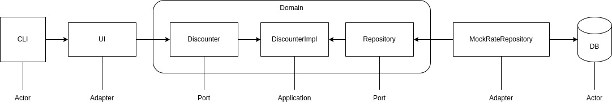

# The Pattern: Ports and Adapters

## Description
This is a example of The Pattern: Ports and Adapters.

## Diagram

## References
- [Alistair Cockburn](https://alistair.cockburn.us/hexagonal-architecture/)
- [Code Soapbox](https://codesoapbox.dev/ports-adapters-aka-hexagonal-architecture-explained/)
- [Tugce Konuklar Dogantekin](https://medium.com/idealo-tech-blog/hexagonal-ports-adapters-architecture-e3617bcf00a0)